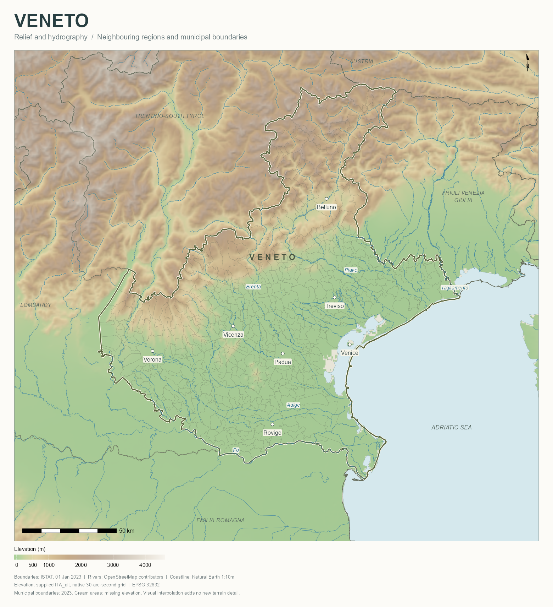
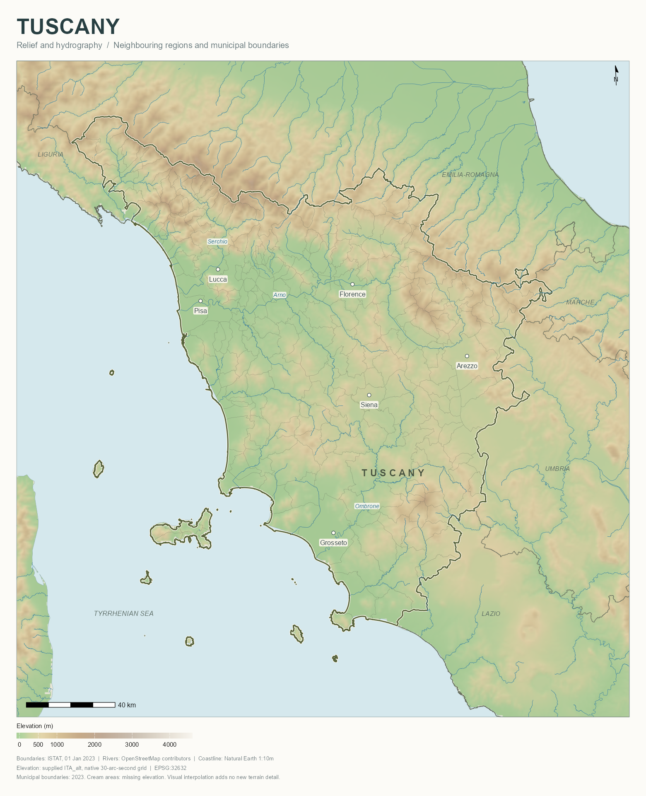
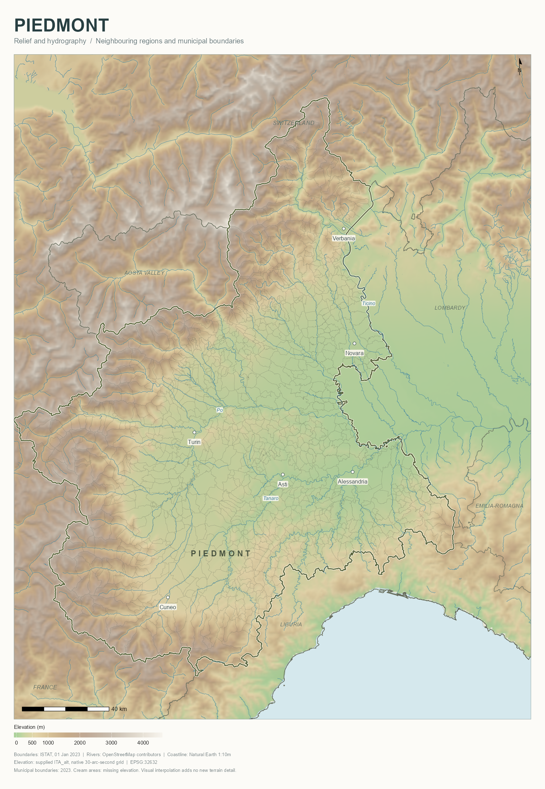
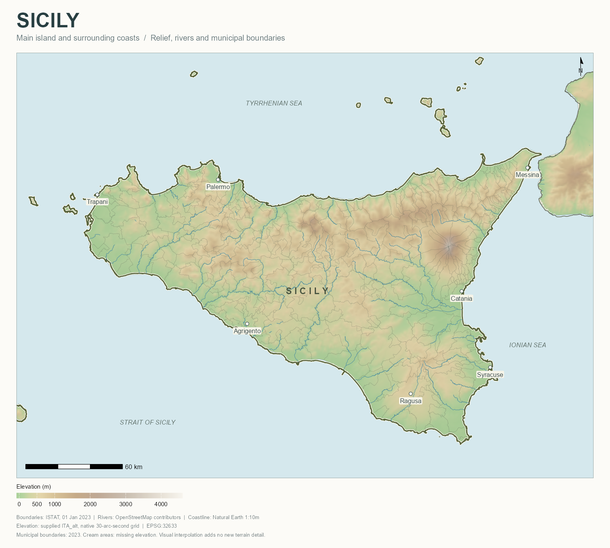

# Italy mapping

**An R package by Marco Aurelio Ramirez Mauricio · 2026**

Create publication-quality maps of Italian regions with green lowlands, shaded
relief, a detailed river network, regional boundaries and optional municipalities.
All map labels are in English; the only legend is elevation. The package includes
the national GIS layers and renders maps **offline**.

| Veneto | Tuscany |
|:--:|:--:|
|  |  |
| Piedmont | Sicily |
|  |  |

## Install

R 4.4 or newer is required. From GitHub:

```r
install.packages("remotes")
remotes::install_github("MarcoRMz95/Italy-mapping")
library(italymapping)
```

This repository is initially private, so your GitHub account must have access.
You can also download the source package from the repository release and install
it locally. Install its dependencies first:

```r
install.packages(c("sf", "terra", "ggplot2", "ragg", "ggspatial", "scales"))
install.packages("italymapping_1.0.0.tar.gz", repos = NULL, type = "source")
```

The package itself contains R code only. On Windows and macOS, CRAN normally
provides binaries for its dependencies. Linux installations of `sf` and `terra`
may require GDAL, GEOS and PROJ development libraries. The included municipality
archive is unpacked into a writable session cache on first use; no data downloads
occur while rendering.

## Your first map

```r
library(italymapping)

p <- italy_example("veneto")
print(p)
save_italy_map(p, "veneto", output_dir = "maps", dpi = 400)
```

This writes a 5,200-pixel-wide PNG, an LZW-compressed TIFF, a lightweight preview
and a metadata text file. Height follows the geographic extent.

## Four complete examples

```r
italy_example("veneto")    # The Veneto map developed for this project
italy_example("tuscany")   # Tuscany, the Arno and the Tyrrhenian coast
italy_example("piedmont")  # Piedmont, the western Alps and the Po
italy_example("sicily")    # Sicily's main island and surrounding coasts
```

Ready-to-run scripts are in [`examples/`](examples/). After installation, run
`Rscript scripts/render_examples.R` from the repository root to regenerate all
four maps at print resolution and refresh the gallery. Full outputs are written
to `output/` and are excluded from Git; lightweight gallery images are tracked.

## Choose another region or area

```r
italy_regions()  # All 20 regions: codes, Italian names and English names

p <- plot_italy_map("Lombardy")
p <- plot_italy_map("Lombardia")  # Italian and English names both work
p <- plot_italy_map(3)            # ISTAT codes work too

p <- plot_italy_map(
  c("Veneto", "Friuli Venezia Giulia"),
  municipalities = FALSE,
  title = "NORTH-EASTERN ITALY"
)

# A custom frame: longitude/latitude in WGS84, not UTM metres.
p <- plot_italy_map(
  "Tuscany",
  bbox = c(xmin = 10.0, ymin = 42.5, xmax = 12.0, ymax = 44.2),
  resolution_m = 500
)
```

Municipal outlines are limited to the selected regions and are drawn only over
land. Neighbouring regional borders remain visible. UTM 32N or 33N is chosen
automatically, or can be set explicitly with `crs = 32632` / `crs = 32633`.

## Adjust labels and presentation

```r
custom_cities <- data.frame(
  label = c("Florence", "Pisa"),
  lon = c(11.255, 10.401),
  lat = c(43.770, 43.716)
)

p <- italy_example(
  "tuscany",
  cities = custom_cities,
  municipalities = TRUE,
  green_lowlands = TRUE
)
```

`cities`, `region_labels`, `river_labels` and `extra_labels` use the same
`label`, `lon`, `lat` structure. River names are anchored to their actual geometry.
The curated default city labels cover the four examples; supply your own city
table for other regions. The returned object is a regular `ggplot`, so titles,
themes and additional layers can be edited using ggplot2.

For a persistent municipal cache:

```r
options(italymapping.cache_dir = file.path(tempdir(), "italy-cache"))
```

Replace `tempdir()` with a persistent writable folder if reuse across sessions is
desired. A custom `data_dir` can supply replacement GIS sources with the same
filenames and schemas.

## Included data

| Dataset | Scope and reference |
|---|---|
| ISTAT regions | 20 regions, supplied 1 January 2023 snapshot |
| ISTAT municipalities | 7,901 municipalities, original geometry detail, zipped GeoPackage |
| OpenStreetMap rivers | 14,054 unique river ways, September 2026 national extract and border context |
| Natural Earth land | Physical coastline and coastal lagoons, Italy and surrounding context |
| Supplied `ITA_alt` elevation | National 30-arc-second raster, converted losslessly to GeoTIFF |
| Curated labels | English region names and example-city coordinates |

The original elevation grid is about 650 × 930 m in Veneto. Interpolation to
400 m smooths its display; it does not add terrain detail. Cream areas indicate
missing elevation. Physical coastlines, rather than altitude thresholds, separate
sea and coastal lagoons from land. The land mask does not delineate every inland
lake. The Sicily example focuses on the main island; remote islands are outside
its chosen frame.

Rivers are drawn from one source, with exact line merging and no invented gap
connectors. The source may contain independent arms and intermittent rivers.
Administrative boundaries describe the supplied 2023 snapshot, not 2026.

See the [data notes](inst/DATA-NOTES.md) for each layer's source, date and links.
The software is MIT-licensed; the GIS bases retain their source-specific terms.

## Citation

**Marco Aurelio Ramirez Mauricio (2026). _Italy mapping: Reproducible Relief and
Administrative Maps of Italy_. R package version 1.0.0.**

```r
citation("italymapping")
```

[`CITATION.cff`](CITATION.cff) also provides GitHub's “Cite this repository” metadata.
Cite the underlying GIS sources separately when using their data.

## Package structure

```text
R/                    Exported functions and regional presets
man/                  R help pages
inst/extdata/         Bundled national GIS data
inst/CITATION         Citation returned by R
examples/             Four runnable example scripts
scripts/              Dependency installation, source preparation and rendering
tests/                Installed-data and rendering checks
docs/images/          Verified example gallery
.github/workflows/    Automated R package check
```

To build and check from the parent directory:

```sh
R CMD build Italy-mapping
R CMD check --no-manual --no-vignettes italymapping_1.0.0.tar.gz
```

This is a GitHub-distributed data-rich package, not a CRAN submission. The
compressed municipality archive is intentionally retained at original detail.
